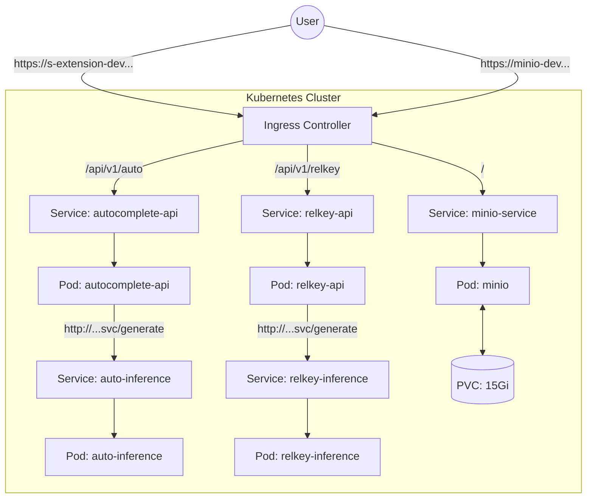

# helm 배포



1. 문법 검사
```Bash
helm lint .
```
 
2. 렌더링 시뮬레이션 (yaml 생성 출력)
```Bash
# --dry-run 모드로 시뮬레이션
# helm install {helm-chart-name} . --dry-run --debug -n {namespace}
# 단, pvc 생성 등은 클러스터를 조회하여 정보를 가져와야 하기 때문에 lookup 등의 옵션으로 pvc 설치 회피 등이 불가능
# dry-run 테스트시 pvc는 주석 처리 후 테스트
helm install search-query . --dry-run --debug -n autocomplete
```

3. 실제 배포
```Bash
# helm upgrade --install {helm-chart-name} . -n {namespace} --create-namespace
helm upgrade --install search-query . -n autocomplete --create-namespace
```

4. 배포 확인
```Bash
helm list -n autocomplete
NAME                    NAMESPACE       REVISION        UPDATED                                 STATUS          CHART                           APP VERSION
llm-search-query        autocomplete    1               2026-01-13 09:58:42.372496 +0900 KST    deployed        searchquery-services-0.1.0      1.0.0

kubectl get pods -n autocomplete -w
kubectl logs deployment/autocomplete-inference -n autocomplete -f 
```

5. 배포 삭제
```Bash
# helm 삭제
helm uninstall search-query -n autocomplete

# k8s 수동 삭제: ingress -> serviec -> deploy -> PVC 순으로 삭제
kubectl delete ingress minio-ingress -n autocomplete
kubectl delete svc minio-service -n autocomplete
kubectl delete deploy minio -n autocomplete
kubectl delete pvc minio-pvc-v2 -n autocomplete
kubectl get all,pvc,ingress -n autocomplete 
```
